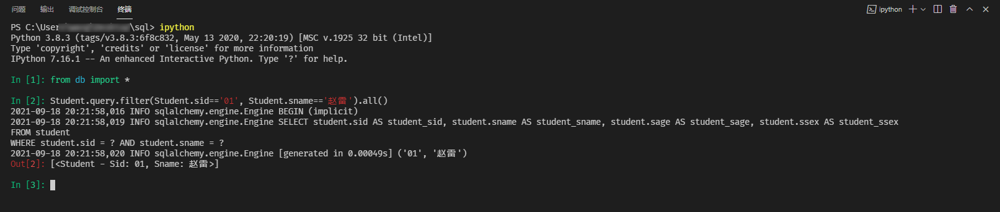

- [测试源码](#测试源码)
- [一: Where 条件](#一-where-条件)
  - [1. And](#1-and)
  - [2. Or](#2-or)
  - [3. Like](#3-like)
  - [4. Between](#4-between)
  - [5. In](#5-in)
- [二. 查询列](#二-查询列)
  - [1. 指定查询列](#1-指定查询列)
  - [2. 别名](#2-别名)
  - [3. Distinct](#3-distinct)
- [三: 聚集](#三-聚集)
  - [1. sum、count、avg](#1-sumcountavg)
  - [2. having](#2-having)
- [四: 连接](#四-连接)
- [五: 子查询](#五-子查询)
- [六: 直接执行SQL语句](#六-直接执行sql语句)

## 测试源码

> sql数据来源，[https://zhuanlan.zhihu.com/p/53302593](https://zhuanlan.zhihu.com/p/53302593)
>
> 表结构 [https://zhuanlan.zhihu.com/p/38354000](https://zhuanlan.zhihu.com/p/38354000)
>
> sqlalchemy参考 [https://www.osgeo.cn/sqlalchemy/tutorial/data.html#selecting-data](https://www.osgeo.cn/sqlalchemy/tutorial/data.html#selecting-data)

```python
import argparse

from datetime import datetime

from flask import Flask
from flask_sqlalchemy import SQLAlchemy
from sqlalchemy.orm import backref


app = Flask(__name__)
app.config['SQLALCHEMY_DATABASE_URI'] = 'sqlite:///example.db'
app.config['SQLALCHEMY_TRACK_MODIFICATIONS'] = False
db = SQLAlchemy(app, engine_options={'echo': True})


class Student(db.Model):
    sid = db.Column(db.String(10), primary_key=True)
    sname = db.Column(db.String(10))
    sage = db.Column(db.DateTime())
    ssex = db.Column(db.String(10))

    scores = db.relationship('Score', backref='student', lazy=True)

    def __repr__(self):
        return '<Student - Sid: %s, Sname: %s>' % (self.sid, self.sname)


class Course(db.Model):
    cid = db.Column(db.String(10), primary_key=True)
    cname = db.Column(db.String(10))
    tid = db.Column(db.String(10), db.ForeignKey('teacher.tid'))

    scores = db.relationship('Score', backref='course', lazy=True)

    def __repr__(self):
        return '<Course %s>' % self.cname


class Teacher(db.Model):
    tid = db.Column(db.String(10), primary_key=True)
    tname = db.Column(db.String(10))

    courses = db.relationship('Course', backref='teacher', lazy=True)

    def __repr__(self):
        return '<Teacher %s>' % self.tname


class Score(db.Model):
    sid = db.Column(db.String(10), db.ForeignKey('student.sid'), primary_key=True)
    cid = db.Column(db.String(10), db.ForeignKey('course.cid'), primary_key=True)
    score = db.Column(db.Integer)

    def __repr__(self) -> str:
        return '<Score - Student: %s, Course: %s, Score: %s>' % (self.sid, self.cid, self.score)


def init_database():
    db.create_all()
    students = [
        Student(sid='01', sname='赵雷', sage=datetime.strptime(
            '1990-01-01', '%Y-%m-%d'), ssex='男'),
        Student(sid='02', sname='钱电', sage=datetime.strptime(
            '1990-12-21', '%Y-%m-%d'), ssex='男'),
        Student(sid='03', sname='孙风', sage=datetime.strptime(
            '1990-05-20', '%Y-%m-%d'), ssex='男'),
        Student(sid='04', sname='李云', sage=datetime.strptime(
            '1990-08-06', '%Y-%m-%d'), ssex='男'),
        Student(sid='05', sname='周梅', sage=datetime.strptime(
            '1991-12-01', '%Y-%m-%d'), ssex='女'),
        Student(sid='06', sname='吴兰', sage=datetime.strptime(
            '1992-03-01', '%Y-%m-%d'), ssex='女'),
        Student(sid='07', sname='郑竹', sage=datetime.strptime(
            '1989-07-01', '%Y-%m-%d'), ssex='女'),
        Student(sid='08', sname='王菊', sage=datetime.strptime(
            '1990-01-20', '%Y-%m-%d'), ssex='女')
    ]
    courses = [
        Course(cid='01', cname='语文', tid='02'),
        Course(cid='02', cname='数学', tid='01'),
        Course(cid='03', cname='英语', tid='03')
    ]
    teachers = [
        Teacher(tid='01', tname='张三'),
        Teacher(tid='02', tname='李四'),
        Teacher(tid='03', tname='王五')
    ]
    scores = [
        Score(sid='01', cid='02', score=90),
        Score(sid='01', cid='03', score=99),
        Score(sid='02', cid='01', score=70),
        Score(sid='02', cid='02', score=60),
        Score(sid='02', cid='03', score=80),
        Score(sid='03', cid='01', score=80),
        Score(sid='03', cid='02', score=80),
        Score(sid='03', cid='03', score=80),
        Score(sid='04', cid='01', score=50),
        Score(sid='04', cid='02', score=30),
        Score(sid='04', cid='03', score=20),
        Score(sid='05', cid='01', score=76),
        Score(sid='05', cid='02', score=87),
        Score(sid='06', cid='01', score=31),
        Score(sid='06', cid='03', score=34),
        Score(sid='07', cid='02', score=89),
        Score(sid='07', cid='03', score=98)
    ]
    db.session.add_all(students)
    db.session.add_all(courses)
    db.session.add_all(teachers)
    db.session.add_all(scores)
    db.session.commit()


parser = argparse.ArgumentParser(description="Flask-Sqlalchemy Example")
parser.add_argument('-i', '--init', help='初始化数据库并导入数据', action='store_true')
args = parser.parse_args()

if args.init:
    init_database()

```

> 执行python db.py -i 可初始化 example.db



## 一: Where 条件

### 1. And 

```python
Student.query.filter(Student.sid=='01', Student.sname=='赵雷').all()
Student.query.filter_by(sid='01', sname='赵雷').all()
Student.query.filter(db.and_(Student.sid=='01', Student.sname=='赵雷')).all()
# [<Student - Sid: 01, Sname: 赵雷>]
```

```sql
-- print(Student.query.filter(Student.sid=='01', Student.sname=='赵雷'))
-- print(Student.query.filter_by(sid='01', sname='赵雷'))
-- print(Student.query.filter(db.and_(Student.sid=='01', Student.sname=='赵雷')))
SELECT student.sid AS student_sid,
       student.sname AS student_sname,
       student.sage AS student_sage,
       student.ssex AS student_ssex
  FROM student
 WHERE student.sid = ? AND 
       student.sname = ?;
```

### 2. Or
```python
Student.query.filter(db.or_(Student.sid=='01', Student.sid=='02')).all()
# [<Student - Sid: 01, Sname: 赵雷>, <Student - Sid: 02, Sname: 钱电>]
```
```sql
-- print(Student.query.filter(db.or_(Student.sid=='01', Student.sid=='02')))
SELECT student.sid AS student_sid,
       student.sname AS student_sname,
       student.sage AS student_sage,
       student.ssex AS student_ssex
  FROM student
 WHERE student.sid = ? OR 
       student.sid = ?;
```
### 3. Like
```python
Student.query.filter(db.or_(Student.sid.like('0%'), Student.sname=='赵雷')).all()
# [<Student - Sid: 01, Sname: 赵雷>,
#  <Student - Sid: 02, Sname: 钱电>,
#  <Student - Sid: 03, Sname: 孙风>,
#  <Student - Sid: 04, Sname: 李云>,
#  <Student - Sid: 05, Sname: 周梅>,
#  <Student - Sid: 06, Sname: 吴兰>,
#  <Student - Sid: 07, Sname: 郑竹>,
#  <Student - Sid: 08, Sname: 王菊>]
```

```sql
-- print(Student.query.filter(db.or_(Student.sid.like('0%'), Student.sname=='赵雷')))
SELECT student.sid AS student_sid,
       student.sname AS student_sname,
       student.sage AS student_sage,
       student.ssex AS student_ssex
  FROM student
 WHERE student.sid LIKE ? OR 
       student.sname = ?;
```
### 4. Between
```python
Student.query.filter(db.and_(Student.sid.like('0%'), Student.sage.between('1991-01-01', '1992-12-12'))).all()
# [<Student - Sid: 05, Sname: 周梅>, <Student - Sid: 06, Sname: 吴兰>]
```

```sql
-- print(Student.query.filter(db.and_(Student.sid.like('0%'), Student.sage.between('1991-01-01', '1992-12-12'))))
SELECT student.sid AS student_sid,
       student.sname AS student_sname,
       student.sage AS student_sage,
       student.ssex AS student_ssex
  FROM student
 WHERE student.sid LIKE ? AND 
       student.sage BETWEEN ? AND ?;
```

### 5. In
```python
Student.query.filter(Student.sid.in_(['01', '02'])).all()
# [<Student - Sid: 01, Sname: 赵雷>, <Student - Sid: 02, Sname: 钱电>]
```

```sql
-- print(Student.query.filter(Student.sid.in_(['01', '02'])))
SELECT student.sid AS student_sid,
       student.sname AS student_sname,
       student.sage AS student_sage,
       student.ssex AS student_ssex
  FROM student
 WHERE student.sid IN (POSTCOMPILE_sid_1);
```

## 二. 查询列

### 1. 指定查询列

```python
db.session.execute(db.select(Student.sid, Student.sname).filter(Student.sid.like('0%'))).all()
# [('01', '赵雷'),
#  ('02', '钱电'),
#  ('03', '孙风'),
#  ('04', '李云'),
#  ('05', '周梅'),
#  ('06', '吴兰'),
#  ('07', '郑竹'),
#  ('08', '王菊')]
```

```sql
-- print(db.select(Student.sid, Student.sname).filter(Student.sid.like('0%')))
SELECT student.sid,
       student.sname
  FROM student
 WHERE student.sid LIKE :sid_1;
```


### 2. 别名
```python
# 查询结果
db.session.execute(db.select(Student.sid.label('StudentSID'))).all()
# 输出
#  [('01',), ('02',), ('03',), ('04',), ('05',), ('06',), ('07',), ('08',)]
print(db.select(Student.sid.label('StudentSID')))
# 对应SQL输出见下方
```
```sql
SELECT student.sid AS StudentSID
  FROM student;
```

### 3. Distinct
```python
db.session.execute(
    db.select(Score.sid.distinct())
).all()
# [('01',), ('02',), ('03',), ('04',), ('05',), ('06',), ('07',)]
```
```sql
-- print(db.select(Score.sid.distinct()))
SELECT DISTINCT score.sid
FROM score
```

## 三: 聚集

### 1. sum、count、avg
```python
db.session.execute(
    db.select(Score.sid, db.func.sum(Score.score).label('total_score')).group_by(Score.sid)
).all()
# [('01', 189),
#  ('02', 210),
#  ('03', 240),
#  ('04', 100),
#  ('05', 163),
#  ('06', 65),
#  ('07', 187)]

db.session.execute(
    db.select(Score.sid, db.func.count(Score.score).label('total_score')).group_by(Score.sid)
).all()
# [('01', 2), ('02', 3), ('03', 3), ('04', 3), ('05', 2), ('06', 2), ('07', 2)]

db.session.execute(
    db.select(Score.sid, db.func.avg(Score.score).label('total_score')).group_by(Score.sid)
).all()
# [('01', 94.5),
#  ('02', 70.0),
#  ('03', 80.0),
#  ('04', 33.333333333333336),
#  ('05', 81.5),
#  ('06', 32.5),
#  ('07', 93.5)]
```

```sql
-- print(db.select(Score.sid, db.func.sum(Score.score).label('total_score')).group_by(Score.sid))
SELECT score.sid,
       sum(score.score) AS total_score
  FROM score
 GROUP BY score.sid;
-- print(db.select(Score.sid, db.func.count(Score.score).label('total_score')).group_by(Score.sid))
SELECT score.sid,
       count(score.score) AS total_score
  FROM score
 GROUP BY score.sid;
-- print(db.select(Score.sid, db.func.avr(Score.score).label('total_score')).group_by(Score.sid))
SELECT score.sid,
       avg(score.score) AS total_score
  FROM score
 GROUP BY score.sid;
```

### 2. having
```python
# 平均分大于80的学号和平局分
db.session.execute(
    db.select(Score.sid, db.func.avg(Score.score).label('total_score')).group_by(Score.sid).having(db.func.avg(Score.score)>80)
).all()
# [('01', 94.5), ('05', 81.5), ('07', 93.5)]
# And/Or同理
db.session.execute(
    db.select(Score.sid, db.func.avg(Score.score).label('total_score')).group_by(Score.sid).having(
          db.and_(db.func.avg(Score.score)>80, db.func.avg(Score.score)<90)
      )
).all()
# [('05', 81.5)]
```

```sql
-- print(db.select(Score.sid, db.func.avg(Score.score).label('total_score')).group_by(Score.sid).having(db.func.avg(Score.score)>80))
SELECT score.sid,
       avg(score.score) AS total_score
  FROM score
 GROUP BY score.sid
HAVING avg(score.score) > :avg_1;
```

## 四: 连接

```python
db.session.execute(
    db.select(Score, Student).select_from(Score).join(Student,
        db.and_(db.or_(Student.sid=='01', Student.sid=='02'), Score.sid==Student.sid)
        )
).all()
# [(<Score - Student: 01, Course: 02, Score: 90>, <Student - Sid: 01, Sname: 赵雷>),
#  (<Score - Student: 01, Course: 03, Score: 99>, <Student - Sid: 01, Sname: 赵雷>),
#  (<Score - Student: 02, Course: 01, Score: 70>, <Student - Sid: 02, Sname: 钱电>),
#  (<Score - Student: 02, Course: 02, Score: 60>, <Student - Sid: 02, Sname: 钱电>),
#  (<Score - Student: 02, Course: 03, Score: 80>, <Student - Sid: 02, Sname: 钱电>)]
```

```sql
SELECT score.sid,
       score.cid,
       score.score,
       student.sid AS sid_1,
       student.sname,
       student.sage,
       student.ssex
  FROM score
       JOIN
       student ON (student.sid = ? OR student.sid = ?) 
                  AND score.sid = student.sid;

```

```python
db.session.execute(
    db.select(Score, Student).select_from(Score).join(Student,
        db.and_(db.or_(Student.sid=='01', Student.sid=='02'), Score.sid==Student.sid), 
        isouter=True) # left outer join
).all()
# [(<Score - Student: 01, Course: 02, Score: 90>, <Student - Sid: 01, Sname: 赵雷>),
#  (<Score - Student: 01, Course: 03, Score: 99>, <Student - Sid: 01, Sname: 赵雷>),
#  (<Score - Student: 02, Course: 01, Score: 70>, <Student - Sid: 02, Sname: 钱电>),
#  (<Score - Student: 02, Course: 02, Score: 60>, <Student - Sid: 02, Sname: 钱电>),
#  (<Score - Student: 02, Course: 03, Score: 80>, <Student - Sid: 02, Sname: 钱电>),
#  (<Score - Student: 03, Course: 01, Score: 80>, None),
#  (<Score - Student: 03, Course: 02, Score: 80>, None),
#  (<Score - Student: 03, Course: 03, Score: 80>, None),
#  (<Score - Student: 04, Course: 01, Score: 50>, None),
#  (<Score - Student: 04, Course: 02, Score: 30>, None),
#  (<Score - Student: 04, Course: 03, Score: 20>, None),
#  (<Score - Student: 05, Course: 01, Score: 76>, None),
#  (<Score - Student: 05, Course: 02, Score: 87>, None),
#  (<Score - Student: 06, Course: 01, Score: 31>, None),
#  (<Score - Student: 06, Course: 03, Score: 34>, None),
#  (<Score - Student: 07, Course: 02, Score: 89>, None),
#  (<Score - Student: 07, Course: 03, Score: 98>, None)]
```

```sql
SELECT score.sid,
       score.cid,
       score.score,
       student.sid AS sid_1,
       student.sname,
       student.sage,
       student.ssex
  FROM score
       LEFT OUTER JOIN
       student ON (student.sid = ? OR student.sid = ?) 
                  AND score.sid = student.sid;

```

## 五: 子查询

> 1、查询“01”课程比“02”课程成绩高的所有学生的学号；
```python
subq1 = db.select(Score).filter_by(cid='01').subquery()
subq2 = db.select(Score).filter_by(cid='02').subquery()
db.session.execute(
    db.select(subq1.c.sid.distinct()).select_from(subq1).join(subq2, subq1.c.sid==subq2.c.sid, isouter=True).filter(subq1.c.score>subq2.c.score)
).all()
# [('02',), ('04',)]
```

```sql
SELECT DISTINCT anon_1.sid
  FROM (
           SELECT score.sid AS sid,
                  score.cid AS cid,
                  score.score AS score
             FROM score
            WHERE score.cid = ?
       )
       AS anon_1
       LEFT OUTER JOIN
       (
           SELECT score.sid AS sid,
                  score.cid AS cid,
                  score.score AS score
             FROM score
            WHERE score.cid = ?
       )
       AS anon_2 ON anon_1.sid = anon_2.sid
 WHERE anon_1.score > anon_2.score;
```

> 5、查询没学过“张三”老师课的同学的学号、姓名；

select

```python
subq = db.select(Score.sid).select_from(Teacher).join(Course, Teacher.tid==Course.tid, isouter=True).join(Score, Course.cid==Score.cid, isouter=True).where(Teacher.tname=='张三')
'''
SELECT score.sid
  FROM teacher
       LEFT OUTER JOIN
       course ON teacher.tid = course.tid
       LEFT OUTER JOIN
       score ON course.cid = score.cid
 WHERE teacher.tname = '张三';

'''
# [('01',), ('02',), ('03',), ('04',), ('05',), ('07',)]
db.session.execute(
  db.select(Student.sid, Student.sname).filter(~Student.sid.in_(subq))
).all()
# [('06', '吴兰'), ('08', '王菊')]
```

```sql
SELECT student.sid,
       student.sname
  FROM student
 WHERE (student.sid NOT IN (
           SELECT score.sid
             FROM teacher
                  LEFT OUTER JOIN
                  course ON teacher.tid = course.tid
                  LEFT OUTER JOIN
                  score ON course.cid = score.cid
            WHERE teacher.tname = ?
       )
       );
```


## 六: 直接执行SQL语句

```python
db.session.execute(db.text('select * from student')).all()
# [('01', '赵雷', '1990-01-01 00:00:00.000000', '男'),
#  ('02', '钱电', '1990-12-21 00:00:00.000000', '男'),
#  ('03', '孙风', '1990-05-20 00:00:00.000000', '男'),
#  ('04', '李云', '1990-08-06 00:00:00.000000', '男'),
#  ('05', '周梅', '1991-12-01 00:00:00.000000', '女'),
#  ('06', '吴兰', '1992-03-01 00:00:00.000000', '女'),
#  ('07', '郑竹', '1989-07-01 00:00:00.000000', '女'),
#  ('08', '王菊', '1990-01-20 00:00:00.000000', '女')]
```
